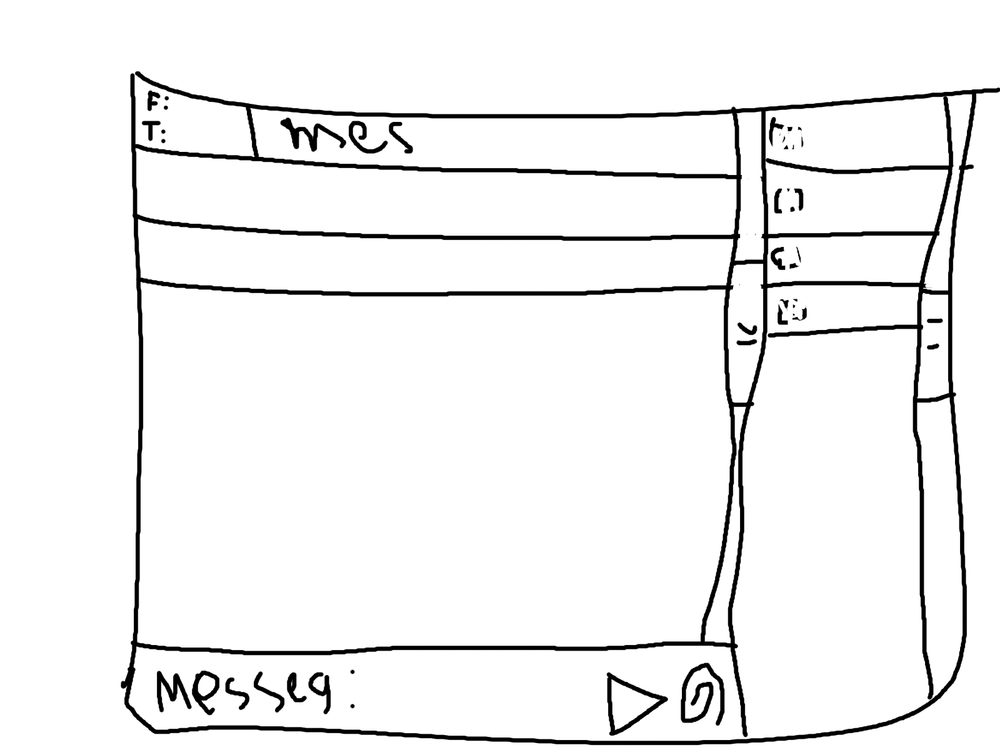
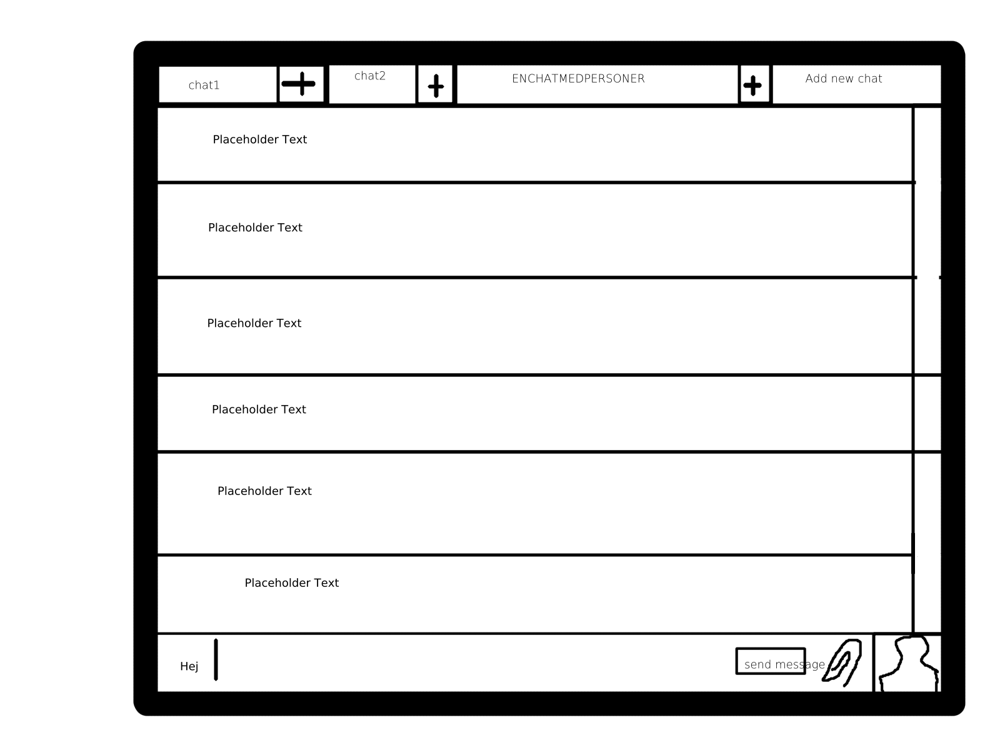

# Meddelandesystem Notes

## Table of Contents

- [Meddelandesystem Notes](#meddelandesystem-notes)
  - [Table of Contents](#table-of-contents)
  - [Requirements](#requirements)
    - [Server](#server)
    - [Client](#client)
  - [Design of the system](#design-of-the-system)
    - [Shared](#shared)
      - [Entity](#entity)
    - [Server](#server-1)
      - [Control](#control)
      - [Entity](#entity-1)
    - [Client](#client-1)
      - [Boundary](#boundary)
      - [Control](#control-1)
  - [Ideas](#ideas)
    - [GUI First Iterations](#gui-first-iterations)
    - [GUI Second Iterations](#gui-second-iterations)
    - [Group chat](#group-chat)

## Requirements

### Server
- [ ] Multiple clients.
- [ ] Client have the ability to disconnect.
- [ ] Update the connected clients with list of connected clients.
- [ ] User sends one message to multiple recipients?
- [ ] Save the unsent messages. (The user message trying to reach is offline).
- [ ] Send the unsent messages. (The user message trying to reach is online).
- [ ] Log the traffic to a file.

### Client
- [ ] Connect to the server.
- [ ] Disconnect from the server.
- [ ] Sends a message.
- [ ] Receive a message.
- [ ] Show connected users.
- [ ] Choose username and profile image before connecting to the server.
- [ ] Have the ability to add the connected user on the server to the personal contact list.
- [ ] The contact list are to be stored on the disk.
- [ ] When relaunching it should be reading the file stored on the disk to load th settings, (Contact list, Username, Profile image).
- [ ] The process of writing text and choosing image should be easy for the user. (JFileChooser). JPEG or PNG works and the text can be plain text.

## Design of the system

### Shared

#### Entity

```java
class User {
    String username;
    ImageIcon image;
}
```

```java
class Message {
    User sender;
    User[] receiverList;
    String text;
    ImageIcon image; //can be null in a sent message
    String sentTime; //server's job to write
    String receivedTime; //see above
}
```

```java
class Clients {
    HashMap<User, Client> clients;
}
```

### Server

#### Control

```java
class ServerController {
    Buffer<Message> receivedMessages;

    sendMessage(Message);
    logTraffic();

    class ServerSocketListener {
        //listens for a tcp connection and creates a new thread for that connection.
        //putts that object in an ArrayList too keep track of too.
    }

    class MessageListener { //one per connection
        //listens for a message object and puts it in a buffer
        //adds a received timestamp first.
    }

    class MessageSender { //one
        //tries too get messages from a buffer.
        //checks if the user it is meant for is online
        //if it is it sends the message using MessageListener's socket (THIS IS LIKELY TO BREAK TRY TOO FIX IT)
        //if it isn't it adds it too UnsentMessages too be sent later.
    }
}
```

```java
class Logger {
    
}
```

#### Entity

```java
class UnsentMessages {}
    storeMessages(Message);
    // called upon later so they get sent when receiver comes online
```

### Client

#### Boundary

```java
class ClientUI {
    // All the interactions between the user
    // Calls the ClientController
}
```

#### Control

```java
class ClientController {
    Buffer<Message> incomingMessageBuffer;
    Buffer<Message> outgoingMessageBuffer;

    storeContacts(contactList);
    sendMessage(Message);

    class Listener {
        //run that listens too messages and puts them in a buffer
        //and fires a propertyChange too let the gui know there is a new message
    }
}
```

## Ideas

### GUI First Iterations



### GUI Second Iterations



### Group chat

